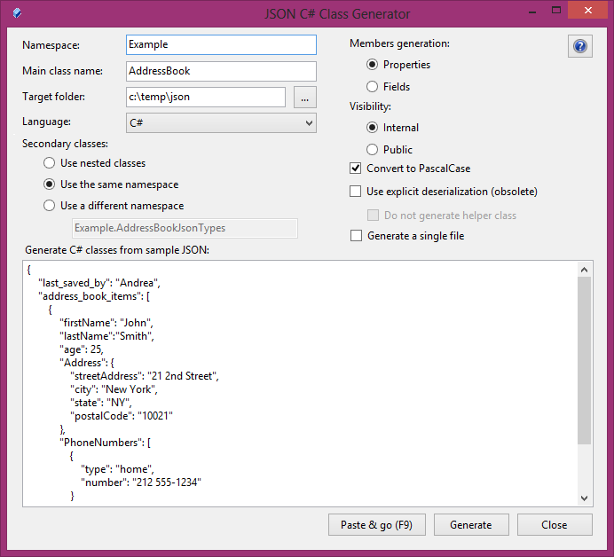
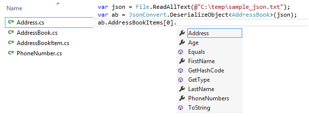

# -JSON-C-Class-Generator
 generates C# classes from a sample JSON text, so you can use strongly typed programming with JSON. It currently supports typed arrays, typed objects, integers, floats, booleans, strings and nullable types

Source: Codeplex by http://www.ndepend.com/
